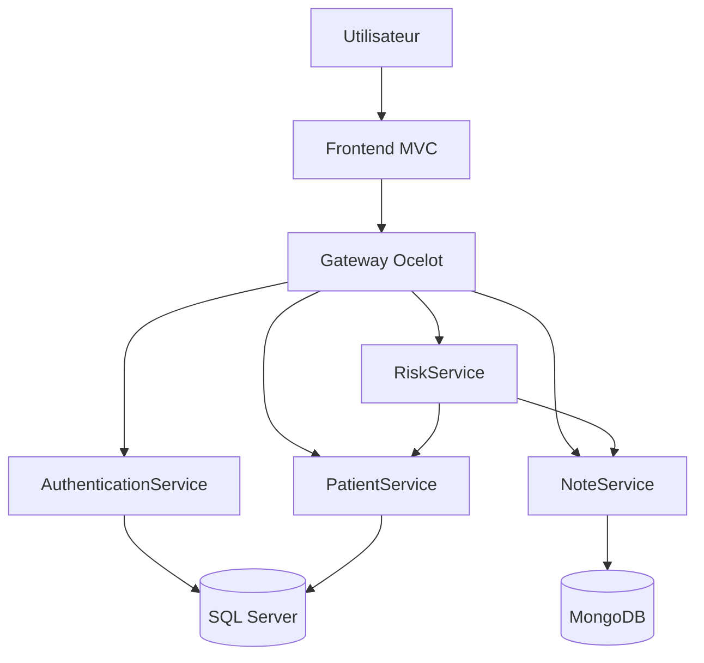

# Mediscreen

Mediscreen est une application de suivi médical permettant de gérer les patients, leurs observations médicales et d'évaluer leur niveau de risque de développer un diabète.

Ce projet a été réalisé en **C# avec .NET 10** dans le cadre du projet 10 de la formation Développeur Back-End .NET d'OpenClassrooms.

## Fonctionnalités

- authentification d'un utilisateur avec ASP.NET Core Identity et JWT ;
- consultation, création et modification des patients ;
- consultation, création, modification et suppression des notes médicales ;
- calcul automatique du niveau de risque de diabète ;
- détection des termes déclencheurs en français et en anglais ;
- recherche des termes insensible à la casse et aux accents ;
- accès centralisé aux API par une Gateway Ocelot ;
- lancement de toute l'application avec Docker Compose ;
- tests unitaires et tests d'intégration automatisés.

## Architecture

L'application utilise une architecture en microservices :

| Projet | Rôle | Stockage |
|---|---|---|
| `AuthenticationService.Api` | Authentification et création des JWT | SQL Server |
| `PatientService.Api` | Gestion des patients | SQL Server |
| `NoteService.Api` | Gestion des notes médicales | MongoDB |
| `RiskService.Api` | Évaluation du risque de diabète | Aucun stockage dédié |
| `Mediscreen.Gateway` | Point d'entrée des API avec Ocelot | Aucun |
| `Mediscreen.Frontend` | Interface utilisateur ASP.NET Core MVC | Session utilisateur |
| `Mediscreen.Tests` | Tests unitaires et d'intégration | Bases temporaires |

Le service d'évaluation du risque interroge le service Patient pour obtenir la date de naissance et le genre du patient, puis le service Notes pour analyser son historique médical.



## Technologies utilisées

- .NET 10 et ASP.NET Core ;
- ASP.NET Core MVC ;
- ASP.NET Core Identity ;
- JSON Web Token (JWT) ;
- Entity Framework Core ;
- SQL Server ;
- MongoDB ;
- Ocelot API Gateway ;
- Docker et Docker Compose ;
- xUnit, Moq, WebApplicationFactory et Testcontainers ;
- GitHub Actions.

## Prérequis

Pour exécuter toute l'application avec Docker :

- [Docker Desktop](https://www.docker.com/products/docker-desktop/) ;
- Git.

Pour compiler ou exécuter les tests sans utiliser uniquement les images Docker :

- [.NET SDK 10](https://dotnet.microsoft.com/download/dotnet/10.0).

Docker Desktop doit être démarré avant de lancer l'application ou les tests d'intégration du service Notes.

## Configuration

À la racine du dépôt, créer le fichier `.env` à partir du modèle fourni :

```powershell
Copy-Item .env.example .env
```

Sous Linux ou macOS :

```bash
cp .env.example .env
```

Compléter ensuite les variables du fichier `.env` :

```dotenv
SQL_SA_PASSWORD=VotreMotDePasseSqlRobuste
JWT_KEY=VotreCleJwtLongueEtAleatoire
DEMO_USER_EMAIL=demo@mediscreen.com
DEMO_USER_PASSWORD=VotreMotDePasseDeDemonstration
```

La clé JWT doit être suffisamment longue et identique pour les services qui créent ou valident les jetons.

Le fichier `.env` contient des informations sensibles et ne doit jamais être ajouté au dépôt Git.

## Lancement avec Docker

Depuis la racine du projet :

```powershell
docker compose up -d --build
```

Afficher l'état des conteneurs :

```powershell
docker compose ps
```

L'interface est ensuite disponible à l'adresse suivante :

<http://localhost:7141>

Le conteneur `note-seeder` importe les notes de démonstration puis s'arrête normalement avec le code `0`.

Les quatre patients utilisés pour valider les niveaux de risque sont automatiquement ajoutés à la base de données lors du premier démarrage.

## Compte de démonstration

Les identifiants correspondent aux valeurs configurées dans `.env`.

Avec les valeurs proposées dans `.env.example` :

```text
E-mail : demo@mediscreen.com
Mot de passe : Demo123!
```

Ces identifiants sont destinés uniquement à la démonstration et au développement local.

## Arrêt et redémarrage

Arrêter les conteneurs sans supprimer les données :

```powershell
docker compose down
```

Reconstruire et relancer toute l'application :

```powershell
docker compose up -d --build
```

Supprimer également les volumes et réinitialiser les bases de données :

```powershell
docker compose down -v
```

> Attention : l'option `-v` supprime les données SQL Server et MongoDB enregistrées dans les volumes Docker.

## Exécution des tests

Docker Desktop doit être actif, car les tests d'intégration du service Notes utilisent Testcontainers pour démarrer une base MongoDB temporaire.

Depuis la racine du dépôt :

```powershell
dotnet test
```

Les tests couvrent notamment :

- l'authentification et le contenu des JWT ;
- les opérations de gestion des patients ;
- les opérations de gestion des notes ;
- les appels HTTP des différents services ;
- toutes les règles de calcul du risque ;
- les quatre cas patients attendus ;
- la détection des déclencheurs sans tenir compte de la casse ou des accents.

## Niveaux de risque

Le service renvoie l'un des résultats suivants :

| Valeur | Signification |
|---|---|
| `None` | Aucun risque identifié |
| `Borderline` | Risque limité |
| `InDanger` | Danger |
| `EarlyOnset` | Apparition précoce |

Le calcul dépend de l'âge, du genre et du nombre de déclencheurs distincts présents dans les notes médicales.

Les déclencheurs analysés sont :

- Hémoglobine A1C ;
- Microalbumine ;
- Taille ;
- Poids ;
- Fumeur ;
- Anormal ;
- Cholestérol ;
- Vertige ;
- Rechute ;
- Réaction ;
- Anticorps.

Le résultat et la liste des déclencheurs détectés sont affichés sur la fiche du patient.

## Principales routes de la Gateway

Toutes les routes, sauf la connexion, nécessitent un JWT valide.

| Méthode | Route | Description |
|---|---|---|
| `POST` | `/gateway/auth/login` | Connexion |
| `GET` | `/gateway/patients` | Liste des patients |
| `GET` | `/gateway/patients/{id}` | Détail d'un patient |
| `POST` | `/gateway/patients` | Création d'un patient |
| `PUT` | `/gateway/patients/{id}` | Modification d'un patient |
| `GET` | `/gateway/notes/patient/{patientId}` | Notes d'un patient |
| `POST` | `/gateway/notes` | Création d'une note |
| `GET` | `/gateway/notes/{id}` | Détail d'une note |
| `PUT` | `/gateway/notes/{id}` | Modification d'une note |
| `DELETE` | `/gateway/notes/{id}` | Suppression d'une note |
| `GET` | `/gateway/risk/{patientId}` | Évaluation du risque |

## Structure du dépôt

```text
Mediscreen-P10/
├── AuthenticationService.Api/
├── Mediscreen.Frontend/
├── Mediscreen.Gateway/
├── Mediscreen.Tests/
├── NoteService.Api/
├── PatientService.Api/
├── RiskService.Api/
├── .dockerignore
├── .env.example
├── compose.yml
└── Mediscreen-P10.slnx
```

Chaque microservice possède son propre `Dockerfile`. Le fichier `compose.yml` situé à la racine permet de construire et de lancer l'ensemble de l'application.

## Green Code

Plusieurs choix contribuent à limiter les ressources consommées par l'application :

- séparation des responsabilités pour pouvoir faire évoluer ou dimensionner chaque service indépendamment ;
- absence de base de données dédiée pour le service de risque lorsque la persistance n'est pas nécessaire ;
- images Docker multi-étapes afin de ne conserver que les composants nécessaires à l'exécution ;
- utilisation d'images d'exécution plutôt que des SDK complets dans les conteneurs finaux ;
- requêtes asynchrones afin de ne pas bloquer inutilement les threads ;
- recherche des déclencheurs sur l'ensemble du dossier médical en un seul traitement ;
- détection de déclencheurs distincts pour éviter les calculs et résultats redondants ;
- réutilisation des connexions HTTP grâce à `HttpClientFactory` ;
- import des données de démonstration idempotent ;
- volumes Docker pour éviter la recréation systématique des bases ;
- tests automatisés pour détecter rapidement les régressions et limiter les cycles de correction.

Une architecture distribuée possède aussi un coût : davantage de conteneurs, de communications réseau et de mémoire. Pour un environnement de production, il faut donc mesurer la consommation réelle et ajuster le nombre d'instances aux besoins plutôt que de surdimensionner les services.

## Auteur

**Michaël LELU**

Projet réalisé dans le cadre de la formation Développeur Back-End .NET d'OpenClassrooms.
